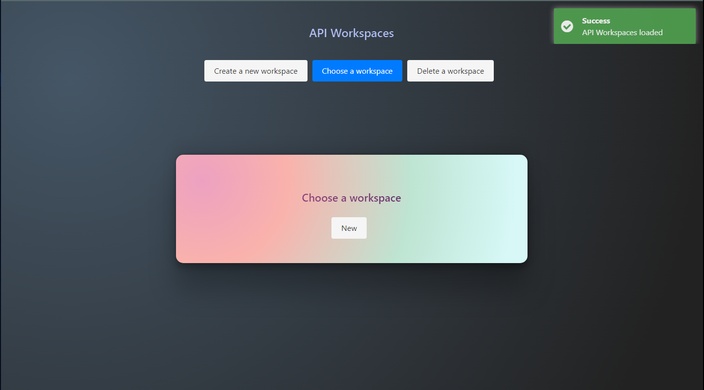
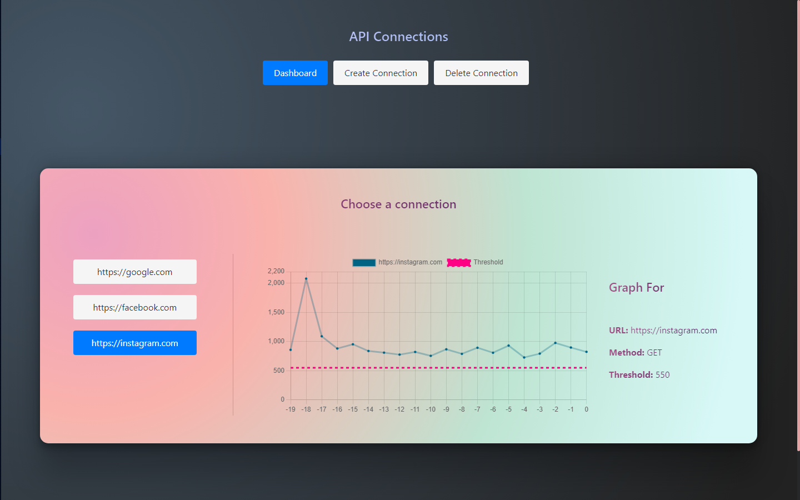

# Server Health Monitoring Application


## About

The Server Health Monitoring Application is a full-stack application built using React, Node.js, MongoDB, and Redis. It allows users to monitor the response times of multiple servers in real-time. The application is containerized and orchestrated using Docker Compose, making it easy to deploy and manage.

## File Structure

```
server-health-monitoring/
|-- client/ # React frontend (Client)
|-- server/ # Node.js backend (Server)
|-- redis/ # Redis server configuration
|-- mongodb/ # MongoDB server configuration
|-- docker-compose.yml
|-- README.md
```

## Requirements

To run the Server Health Monitoring Application, you will need the following tools and technologies installed on your system:

1. [Docker](https://www.docker.com/get-started) - For containerization of microservices.
2. [Docker Compose](https://docs.docker.com/compose/install/) - To define and manage multi-container Docker applications.

## Installation

To run the Server Health Monitoring Application locally, make sure you have Docker and Docker Compose installed on your system. Then, follow these steps:

1. Clone this repository:

```
git clone https://github.com/your-username/server-health-monitoring.git
```

```
cd server-health-monitoring
```

2. Build the Docker images and start the containers:

```
docker-compose up -d
```

3. The application will be available at:
   - Frontend (React) - http://localhost:1234

## Screenshots




## License

This project is licensed under the [GNU General Public License v3.0](LICENSE).

## Author

This Server Health Monitoring Application was created by [@sbk2k1](https://github.com/sbk2k1).

If you have any questions or feedback, feel free to reach out!
